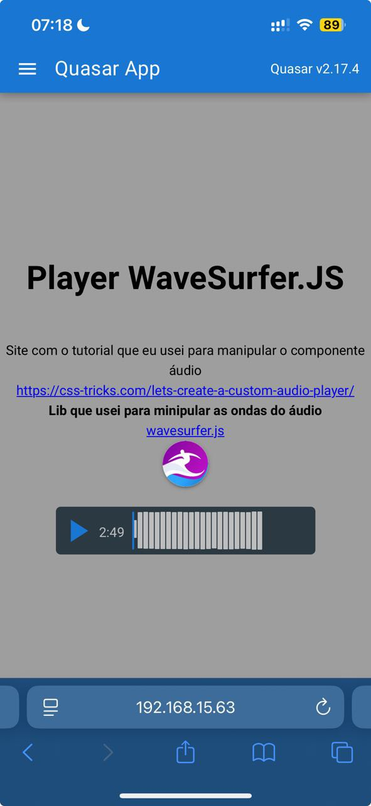
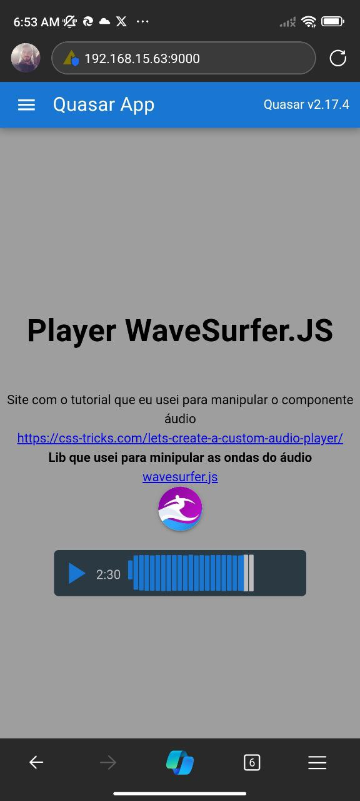

# Auido Waves (audio-waves)

Exmplos de áudios personalizados

## Install the dependencies

```bash
yarn
# or
npm install
```

### Start the app in development mode (hot-code reloading, error reporting, etc.)

```bash
quasar dev
```

### Lint the files

```bash
yarn lint
# or
npm run lint
```

### Format the files

```bash
yarn format
# or
npm run format
```

### Build the app for production

```bash
quasar build
```

### Customize the configuration

See [Configuring quasar.config.js](https://v2.quasar.dev/quasar-cli-vite/quasar-config-js).

### Screnshots

### IOS



### Android



### Screens videos

### IOS

<video width="320" height="240" controls>
  <source src="./public/ios.mp4" type="video/mp4">
  Your browser does not support the video tag.
</video>

### Android

<video width="320" height="240" controls>
  <source src="./public/android.mp4" type="video/mp4">
  Your browser does not support the video tag.
</video>
